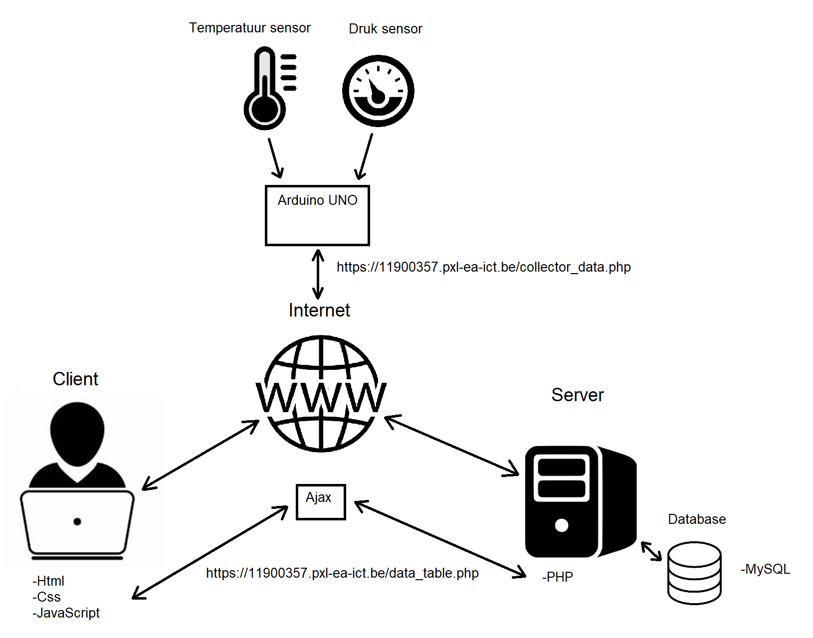

# Full circuit:

De temperatuur en druk sensoren zijn verbonden met een Arduino UNO met een ethernet shield. De Arduino meet de waardes van de sensoren
en stuurt via de ethernet shield aan de hand van http transfer de verkregen data door en kan deze gesampled worden door de PHP collector page.

Al de PHP code zoals de collector page bijvoorbeeld draait op het server gedeelte van het schema. Ook staat de code voor de grafiek en tabel te genenreren hier op.
De tabel pakt dynamisch de inputs van de client aan de hand van ajax en zoekt ook zo dynamisch door de database om de gefilterde data te displayen aan de client
met html en css zonder dat hij de pagina moet refreshen.

